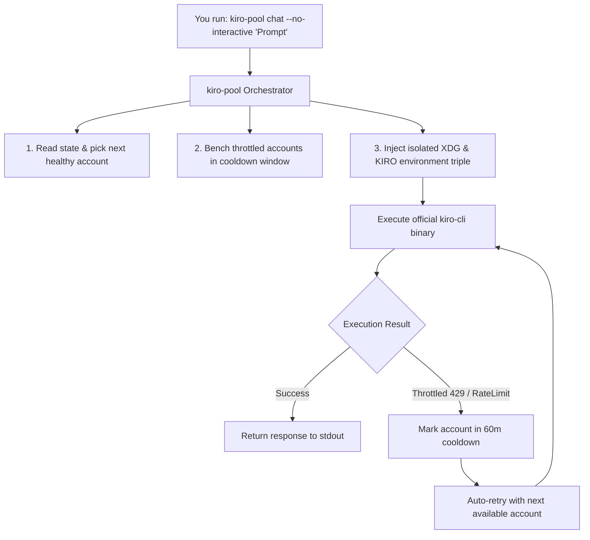

# 🚀 Kiro Account Pool Manager (`kiro-pool`)

<div align="center">

### Multi-Account Pooling, Quota Multiplexing & Auto-Failover for Kiro CLI

[](LICENSE)
[](https://python.org/)
[](https://www.kernel.org/)
[](https://github.com/MishraShardendu22/kiro-account-pool-manager/actions)
[](https://github.com/MishraShardendu22/kiro-account-pool-manager)

<p align="center">
  <b>Scale beyond single-account limits by pooling an arbitrary number ($N$) of Google accounts together under one Linux user. Rotate prompts round-robin across accounts to multiply your available AI quotas, and automatically fail over to healthy accounts when rate limits hit.</b>
</p>

</div>

---

## ⚡ Key Features

* **Unlimited Accounts ($N$):** Connect 2, 5, 10, or 50+ Google accounts with independent session tokens.
* **Ultra-Lightweight (~50 KB / account):** Uses symlink templating to share heavy engine runtimes (`node`, `bun`, `tui.js`, `run/`). 50 accounts use ~2.5 MB instead of 50 GB.
* **Automatic Quota Failover:** Detects HTTP `429`, `ThrottlingError`, or quota exhaustion and immediately retries the prompt with the next available account.
* **Intelligent Cooldown:** Automatically benches throttled accounts for 60 minutes and resumes them once their rate limit resets.
* **Pool Health Dashboard:** View all enrolled Google accounts, active status, cooldown timers, and request counts via `kiro-pool status`.
* **Zero Impact on Default CLI:** Your official `kiro-cli` installation and default primary account remain 100% untouched.

---

## 🏗️ How It Works

Kiro CLI stores authentication tokens in an unencrypted SQLite table at `$XDG_DATA_HOME/kiro-cli/data.sqlite3`.

`kiro-pool` wraps your installed `kiro-cli` binary, dynamically injecting isolated environment variables (`XDG_DATA_HOME`, `KIRO_HOME`, `XDG_RUNTIME_DIR`) per command:



*(See [docs/INTERNAL_ARCHITECTURE.md](docs/INTERNAL_ARCHITECTURE.md) for full reverse-engineered details.)*

---

## 🚀 Quickstart

### 1. Installation

Clone and run the installer:

```bash
git clone https://github.com/MishraShardendu22/kiro-account-pool-manager.git
cd kiro-account-pool-manager
./install.sh
```

Ensure `~/.local/bin` is in your `PATH` (default in Ubuntu and most distributions).

### 2. Enroll Accounts

Enroll as many Google accounts as you want:

```bash
kiro-pool add acc1
kiro-pool add acc2
kiro-pool add acc3
```

> [!IMPORTANT]
> **Avoid Google Cookie Collision:**
> When adding Account 2 or higher:
> 1. In the terminal prompt, select **Use with Google**.
> 2. Copy the authorization URL and open it in an **Incognito / Private window** (or separate browser profile) signed into that specific Google account.

### 3. Check Pool Status

```bash
kiro-pool status
```

**Example Output:**
```text
Kiro Multi-Account Pool Status
========================================================================
Profile         Google Email                     Status          Used  
------------------------------------------------------------------------
acc1            work.dev@gmail.com               Ready           12    
acc2            personal.code@gmail.com          Ready           11    
acc3            experimental@gmail.com           Cooldown (45m)  8     
========================================================================
```

---

## 💡 Usage

### A. Non-Interactive Task Prompts (Automatic Rotation)

Every prompt automatically alternates across your account pool:

```bash
# Prompt 1 -> Uses acc1
kiro-pool chat --no-interactive "Scaffold a FastAPI application"

# Prompt 2 -> Uses acc2
kiro-pool chat --no-interactive "Write pytest integration tests"

# Prompt 3 -> Uses acc1 (or acc3)
kiro-pool chat --no-interactive "Generate Dockerfile and compose file"
```

If an account hits a rate limit, `kiro-pool` automatically marks that account as throttled and reroutes the prompt to a backup account without failing.

### B. Interactive Chat Session (TUI)

```bash
kiro-pool chat
```
* Launches an interactive terminal UI session using the **next available account**.
* That specific multi-turn conversation will stay on that account until you exit (`Ctrl+C` or `/quit`).
* Running `kiro-pool chat` again picks the next account in rotation.

### C. Convenient Shell Alias

Add this alias to your `~/.bashrc` or `~/.zshrc`:
```bash
alias kiro="kiro-pool"
```

Now you can run:
```bash
kiro status
kiro chat --no-interactive "Review PR #42"
```

---

## 📖 Command Reference

| Command | Description |
| :--- | :--- |
| `kiro-pool add <name>` | Enroll a new Google account into the pool |
| `kiro-pool remove <name> [name2...]` | Remove account(s) from the pool (aliases: `rm`, `delete`, `del`) |
| `kiro-pool status` | View account health, cooldowns, and usage (aliases: `list`, `ls`) |
| `kiro-pool reset-cooldown` | Manually clear cooldown timers for all accounts |
| `kiro-pool run <args...>` | Run any Kiro CLI command rotated through the pool |
| `kiro-pool <args...>` | Shorthand for `run` (e.g., `kiro-pool whoami`) |
| `kiro-pool --version` | Display current version number |
| `kiro-pool --help` | Show command usage and options |

---

## 🧪 Running Tests

The test suite runs using Python's native `unittest` framework (zero third-party dependencies):

```bash
python3 -m unittest discover -s tests -v
```

---

## ❓ Frequently Asked Questions

#### Does this modify my default `kiro-cli`?
No. Standard `kiro-cli` continues to use your primary default account and configuration. `kiro-pool` operates strictly in isolated profile directories (`~/.local/share/kiro-profiles/`).

#### Can one open chat window switch accounts mid-conversation?
No. Kiro's cloud runtime anchors conversation threads to the user's Profile ARN. Alternating accounts per message within a single unbroken conversation thread causes backend rejection (`InvalidConversationId`). Rotation happens **per prompt** or **per session**.

#### How do tokens refresh?
Kiro CLI automatically refreshes expired tokens in the background using each profile's independent `.refresh.lock` and SQLite database. No manual re-login is required.

---

## 🤝 Contributing

Contributions are warmly welcomed! Please read our [Contributing Guide](CONTRIBUTING.md) and [Code of Conduct](CODE_OF_CONDUCT.md).

---

## 📄 License

MIT License. See [LICENSE](LICENSE) for details.
